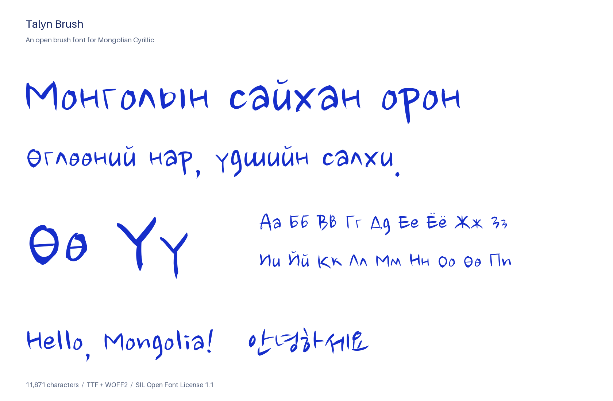
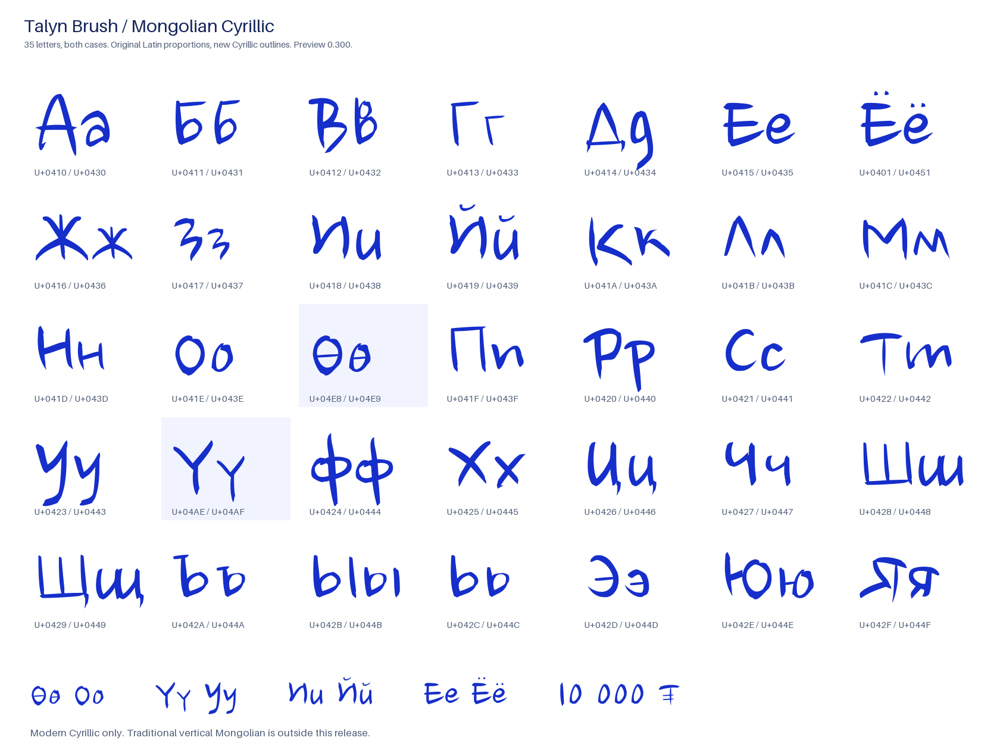

# Talyn Brush

A Mongolian Cyrillic extension of **Nanum Brush Script**, released under its required new family name. Loose, tapered brush lettering with the full 35-letter Mongolian alphabet, including **Өө** and **Үү**, plus German **ÄÖÜ äöü ß ẞ**.

[](https://github.com/christophbuehler/talyn-brush/actions/workflows/font.yml)

[**Try the font**](https://christophbuehler.github.io/talyn-brush/) · [**Download the licensed package**](https://github.com/christophbuehler/talyn-brush/releases/tag/v0.3.0) · [**All 11,871 characters in one image**](https://christophbuehler.github.io/talyn-brush/specimen/all-characters.png)



## What is included

- The complete **Mongolian Cyrillic alphabet**, uppercase and lowercase. This also covers the modern Russian alphabet.
- Original Korean, Latin, punctuation, and symbols: **all 11,789 upstream mappings and all original glyph outlines, metrics, hinting, and GSUB rules are preserved**.
- **82 additions**: 70 Cyrillic letters, eight German letters, combining breve and diaeresis, nonbreaking space, and the tugrik sign **₮**.
- Installable **TTF** and web **WOFF2**, reproducible sources, outline SVGs, and automated proofs.

**Version 0.300 / release v0.3.0 is a preview.** The outlines have automated checks and visual inspection, but have not yet had independent review by a native Mongolian type designer. Feedback on rhythm, spacing, and letterforms is welcome. Traditional vertical Mongolian and the rest of the Cyrillic Extended blocks are outside this release’s scope.

## The alphabet

А Б В Г Д Е Ё Ж З И Й К Л М Н О Ө П Р С Т У Ү Ф Х Ц Ч Ш Щ Ъ Ы Ь Э Ю Я

а б в г д е ё ж з и й к л м н о ө п р с т у ү ф х ц ч ш щ ъ ы ь э ю я

[](https://christophbuehler.github.io/talyn-brush/specimen/cyrillic.png)

Ө is a barred O, never a slashed O. Ү has a straight stem, distinct from У’s descending tail. The Cyrillic revision replaces the rigid miniature capitals with handwritten lowercase: и has a rounded u-shaped movement, п an n-shaped arch, т an m-shaped rhythm, д a descending g-shaped form, and ш two flowing troughs. Shared Latin/Cyrillic skeletons reuse the original brush outlines; other forms reshape and join pieces of that same brushwork for Cyrillic. See [design notes](docs/DESIGN.md) and the [construction recipes](sources/cyrillic.py).

## German letters

**Ä Ö Ü ä ö ü ß ẞ** are included from version 0.300. The umlauts use the original Latin bodies and widths with matching brush dots. Both precomposed characters and a base letter followed by U+0308 work. ß and ẞ have their own outlines and Unicode mappings.

[German word and small-size proof](https://christophbuehler.github.io/talyn-brush/specimen/german.png?v=0.300). Select **Deutsch** in the live tester, or type your own words. This adds the German repertoire; it does not claim complete Latin Extended coverage.

## Every character, rendered by CI

Every push and pull request builds the fonts, tests them, and renders **every Unicode cmap entry directly through FreeType, without a fallback font**. Mongolian prose is shaped through HarfBuzz. Successful main-branch runs publish these proofs to the [specimen site](https://christophbuehler.github.io/talyn-brush/):

- [Complete character atlas — one PNG, approximately 4.9 MB](https://christophbuehler.github.io/talyn-brush/specimen/all-characters.png)
- [31 readable atlas sheets](https://christophbuehler.github.io/talyn-brush/#atlas-title)
- [German letters and words](https://christophbuehler.github.io/talyn-brush/specimen/german.png?v=0.300)
- [Word rhythm and 24/48/96 px proof](https://christophbuehler.github.io/talyn-brush/specimen/words.png)
- [Mongolian Cyrillic proof](https://christophbuehler.github.io/talyn-brush/specimen/cyrillic.png)
- [Machine-readable coverage, glyph IDs, and ink checks](specimen/coverage.json) and [plain character list](specimen/charset.txt)

“Every character” means all encoded Unicode mappings, including inherited Korean and symbol characters; it does not mean every Unicode character or unencoded alternate glyph. Spaces and inherited blank glyphs are labeled `space` in the atlas. The site’s footer and [build manifest](https://christophbuehler.github.io/talyn-brush/build.json) identify the deployed commit. PR artifacts are available from their Actions runs.

## Use

Download and unzip the [release package](https://github.com/christophbuehler/talyn-brush/releases/tag/v0.3.0). Install `fonts/TalynBrush-Regular.ttf` for desktop use. For the web, keep the license alongside your distributed font:

```css
@font-face {
  font-family: "Talyn Brush";
  src: url("TalynBrush-Regular.woff2") format("woff2");
  font-style: normal;
  font-weight: 400;
  font-display: swap;
}

.mongolian {
  font-family: "Talyn Brush", sans-serif;
  line-height: 1.4;
}
```

The full WOFF2 is approximately 590 KiB and includes the inherited Korean repertoire. This is a display face; review your intended words at their actual size. No bold or italic styles are supplied. Unicode NFC and decomposed Ё/Й and German umlaut forms shape identically in the tested HarfBuzz path.

## Build and verify

Python 3.12 is used locally and in CI. Dependencies are pinned. From the repository root:

```sh
python3.12 -m venv .venv
. .venv/bin/activate
python -m pip install -r requirements.txt
python scripts/build.py
python scripts/specimen.py
python scripts/package.py
python scripts/sanitize.py
python -m pytest -q
python scripts/check_reproducible.py
python -m http.server 8000 --directory site
```

CI also checks both binaries with **OpenType Sanitizer** and requires the rebuilt font files to match the committed ones. It checks preservation of the entire upstream glyph inventory, cmap coverage, license/name metadata, marks, kerning, normalization, FreeType rendering at multiple sizes, TTF/WOFF2 equivalence, atlas completeness, and package contents. Font files are reproducible; raster images may vary slightly with FreeType versions.

Edit `sources/cyrillic.py` to change the new outlines. The build exports `sources/svg/` for vector inspection and `sources/features.fea` for layout inspection; both are generated outputs. The original TTF remains the source for inherited glyphs. Every `v*` tag must match the declared package version before the workflow creates a preview release.

## License and credit

**SIL Open Font License 1.1.** Read [OFL.txt](OFL.txt), [FONTLOG.txt](FONTLOG.txt), and the unmodified [OFL FAQ](docs/OFL-FAQ.txt).

Original font: **Nanum Brush Script**, copyright © 2010 **NHN Corporation**, designed by **Sandoll Communications Inc.** The source’s designer field credits **Kwak Doo-yul and Nicolas Noh**. The supplied font and license are archived byte-for-byte in [`upstream/`](upstream/); their origin and hashes are in [PROVENANCE.md](docs/PROVENANCE.md).

Cyrillic and German extensions and build tooling copyright © 2026 **Christoph Bühler**. The font and its build sources are distributed under OFL 1.1. The OFL FAQ retains its own SIL copyright and verbatim-redistribution terms.

The original license reserves **Nanum, Naver Nanum, NanumGothic, Naver NanumGothic, NanumMyeongjo, Naver NanumMyeongjo, NanumBrush, Naver NanumBrush, NanumPen, and Naver NanumPen**. The modified font is named **Talyn Brush** throughout its primary internal names and distributed filenames. No new Reserved Font Names are declared. This is an independent derivative, with no endorsement by NHN, Naver, Sandoll, or Google.

The OFL allows use, modification, embedding, and redistribution under its conditions. Redistributed font software must retain the required copyright/license notices and remain under the OFL; the font cannot be sold by itself. Artwork and documents created with it are not required to use the OFL. See SIL’s [modification guidance](https://openfontlicense.org/how-to-modify-ofl-fonts/) and [Reserved Font Name guidance](https://openfontlicense.org/ofl-reserved-font-names/).
